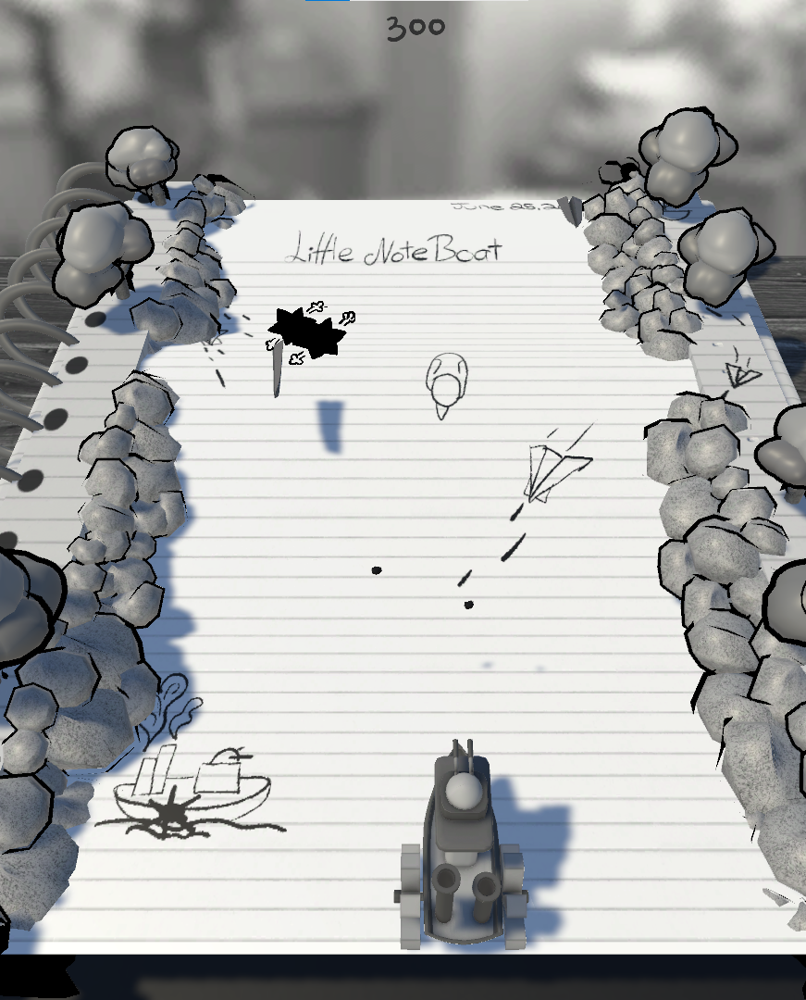
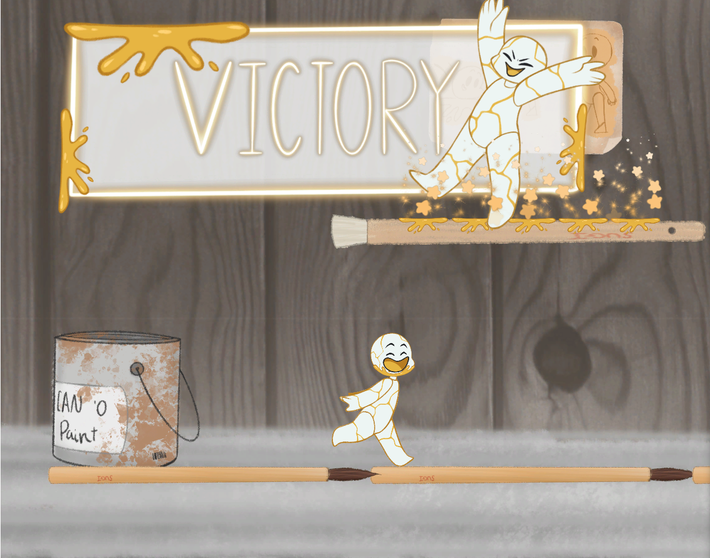

# About Me
My name is Lucas Campbell. I am a game developer that created projects in engine's like Unreal Engine 4 and Unity. I enjoy the challenge of planning puzzles and combat systems.

## Contact Info
 * [Resume](https://raw.githubusercontent.com/lucasCampCode/lucasCampCode/main/Resume.pdf)
 * [Email](mailto:lcampbell0815@gmail.com)
 * [LinkedIn](https://www.linkedin.com/in/lucascampbell1501)

## Projects
### [Doom Buggy](https://doombuggy.itch.io/doom-buggy)

A demolition derby game made during final year in the two year curriculum. in this project i worked on the Vehicle Physics and Enemy AI.

### [Little NoteBoat](https://chicory-games.itch.io/little-noteboat)

A navy battle game where you shoot down paper planes before they shoot you. my contributions to this project was player controls and movement.

### [Sugi: On The Roll](https://baradoros.itch.io/sugi-on-a-roll)

Playing as Sugi you roll around trying to connect you head back to your body. this project is a platformer created during an 8 hour game jam for introduction to team building. For this project I work on the player movement. working along side with one other programmer and one artist.

<h3 align="left">Languages and Tools:</h3>

        

